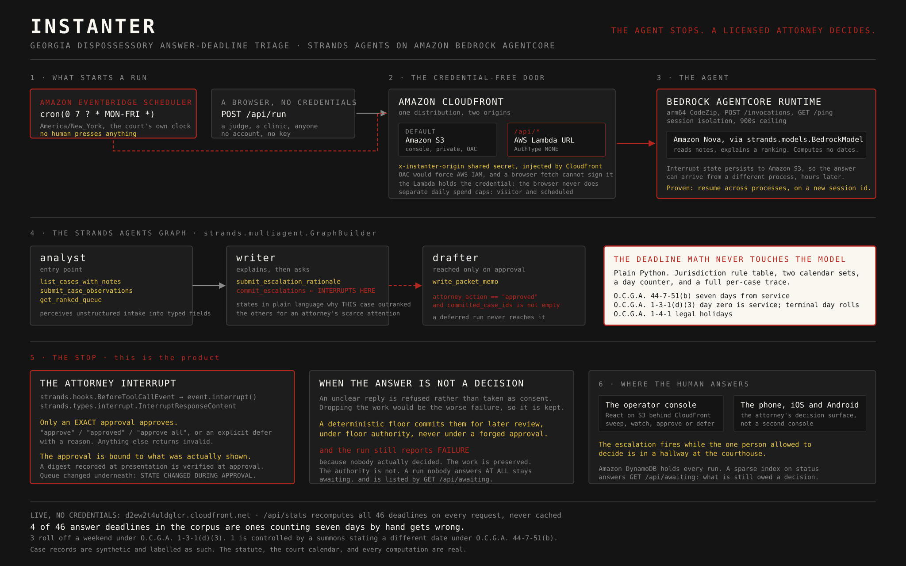

# Instanter

A background triage agent for eviction-defense clinics. It watches a clinic's intake queue of Fulton County, Georgia dispossessory (eviction) cases, computes each tenant's statutory answer deadline in deterministic Python, ranks the queue by proximity to a default writ of possession, and interrupts a supervising attorney for only the cases that cross a capacity-aware escalation threshold. Built with the Strands Agents SDK on Amazon Bedrock AgentCore for the AWS Agents for Humans Hackathon.

> **Instanter provides legal information and deadline computation, not legal advice, and is operated under attorney supervision.** It drafts only and never files. It computes deadlines and never advises. A licensed attorney is the reviewer of every case it surfaces. All demo data is synthetic; the statutory rules are real and public (O.C.G.A. 44-7-51; 1-3-1(d)(3); 1-4-1). No organization is a partner in or endorser of this project.

## See it running

**<https://d2ew2t4uldglcr.cloudfront.net>**. No account, no key, no login.

A three-minute walk for a judge: **<https://d2ew2t4uldglcr.cloudfront.net/judge>**.
The 4 of 46 as lists you can count: **<https://d2ew2t4uldglcr.cloudfront.net/evidence>**.
The filing cabinet, recomputed on this request: **<https://d2ew2t4uldglcr.cloudfront.net/api/queue>**.
What if they were served on a date you pick: **<https://d2ew2t4uldglcr.cloudfront.net/api/what-if?service_date=2026-12-24>** (never capped; that date is the courthouse-closed trap).
Photograph a summons: **<https://d2ew2t4uldglcr.cloudfront.net/#ocr>**. Nova Pro transcribes the printed service date; the engine computes the last day.

**<https://d2ew2t4uldglcr.cloudfront.net/api/stats>** recomputes every answer deadline in the corpus on each request and reports what it found. Nothing there is cached or stored, so the numbers below are measured while you read them:

> **4 of 46 answer deadlines in the corpus are ones counting seven days by hand gets wrong.**
> Three of them roll off a weekend under O.C.G.A. 1-3-1(d)(3). One is controlled by a summons stating a different date, which under O.C.G.A. 44-7-51(b) is the date that binds the tenant. A missed answer deadline in a dispossessory case is a default judgment, which is an eviction.

The endpoint returns both lists in full, so the headline can be checked by counting rows. `infra/verify_door.sh` runs that check, and seven others, from outside with no credentials.

### Run the agent yourself

`POST /api/run` starts a real sweep of all 48 cases on Amazon Bedrock AgentCore. It stops at the attorney interrupt and returns the cases a human is being asked to approve. Answer it with `POST /api/run/{id}/decision`:

```sh
RUN=$(curl -s -X POST https://d2ew2t4uldglcr.cloudfront.net/api/run \
  -H 'Content-Type: application/json' -d '{"capacity":2}' | jq -r .run_id)

curl -s -X POST "https://d2ew2t4uldglcr.cloudfront.net/api/run/$RUN/decision" \
  -H 'Content-Type: application/json' -d '{"response":"approve"}' | jq .result
```

Three answers, three different outcomes, and the third is the one worth trying:

| You send | What happens |
|---|---|
| `approve` | both cases committed, run succeeds |
| `defer: <reason>` | nothing committed, the cases stay listed as owed |
| `aprove` (a typo) | **not read as a decision.** The deterministic floor commits the cases for later review and the run reports failure, because no human actually decided. |

Live runs are capped per day, because this endpoint spends money on a model. `/api/stats` is pure arithmetic and is never capped.

`GET /api/awaiting` reports what is still owed a decision, as counts only. It deliberately publishes no run ids: `/decision` is unauthenticated, so a published id would let any stranger answer the clinic's morning sweep.

### On a phone

The mobile app is the **attorney's decision surface**, not a second console. It exists for the escalation that fires while the one person allowed to decide is in a hallway at the courthouse. Same public door, no second backend.

| | |
|---|---|
| **Android** | [`instanter.apk`](https://github.com/StephenSook/instanter/releases/latest) on the latest release. Signed with our own release key, so Android will ask you to allow the install |
| **iOS** | <https://testflight.apple.com/join/JqZ1wX25>. Build 14 is Beta App Review approved and includes the count-only Live Activity. |

The APK is a release asset rather than a build-service URL on purpose: build-service links expire in days while the repo, CI and deployment all stay green, so the download rots while every check still reports success.

## Status

Under active build for the Agents for Humans Hackathon (submission window Aug 10 to Sep 14, 2026). This README grows with the code; nothing is claimed here before it ships.

Shipped and reachable today: the deterministic deadline engine, the triage agent with its attorney-approval interrupt on AgentCore Runtime, the operator console, the public door above, summons OCR (`POST /api/ocr`), Web Push on a real attorney interrupt (`GET /api/push/vapid`), custom `instanter.*` spans on the run receipt, and S3 Object Lock (Compliance, 30 days) on the audit trail. The iOS app starts a count-only Live Activity at the interrupt. TestFlight build 14 (2026-08-26) includes the widget; join at https://testflight.apple.com/join/JqZ1wX25.

## Why

The seven-day answer window in a Georgia dispossessory case is unforgiving: if the tenant does not answer, the court "shall issue a writ of possession instanter" (O.C.G.A. 44-7-53(a)). In completed 2015 Fulton County dispossessory cases, 54 percent of tenants never answered (Federal Reserve Bank of Atlanta, CED Discussion Paper 04-16, 2016). The Atlanta Volunteer Lawyers Foundation reports nearly 40,000 evictions filed in Fulton County each year, with fewer than 2 percent of tenants represented (avlf.org, 2025). A walk-in clinic cannot watch every clock. Software can.

## Architecture



The design principle, from AWS Prescriptive Guidance: "Use deterministic execution logic unless AI is needed." The deadline math is plain, tested Python. The model perceives (reads intake notes) and communicates (explains an escalation). A human decides.

Two things start a run: **Amazon EventBridge Scheduler** at 7am on weekdays in `America/New_York`, because deadlines are counted in the court's calendar, and a browser with no credentials. Both end in the same place, at the attorney interrupt, with nothing committed.

The agent is a **Strands Agents** `GraphBuilder` graph of three nodes, `analyst → writer → drafter`, where the edge into `drafter` is a real conditional: its predicate is `attorney_action == "approved" and committed_case_ids is not empty`, so a deferred run never reaches it. The interrupt is a `BeforeToolCallEvent` hook calling `event.interrupt()`, and the run's state persists to Amazon S3 so the answer can arrive from a different process.

`InvokeAgentRuntime` accepts only IAM SigV4 or an OAuth bearer token, so a browser cannot reach the agent directly. A Lambda holds the credential and invokes it server-side, behind one CloudFront distribution with two origins. The Function URL stays public and CloudFront injects a shared secret, because Origin Access Control on a Function URL forces `AWS_IAM`, after which a browser POST needs `x-amz-content-sha256` that a plain `fetch` will not send.

## Repository layout

```
engine/    deterministic deadline engine: jurisdiction rule table, 2026 holiday calendars, day-count logic
agent/     the triage agent: typed tools, the attorney-approval interrupt, the ladder, the audit trail
evals/     live evaluation harness plus the recorded run CI gates on
seed/      synthetic intake, labelled EXAMPLE DATA in every record
tests/     statutory test corpus for the engine, plus the agent's chaos and contract suites
docs/      architecture decision records
scripts/   the AI-tone CI gate and the console's queue-snapshot exporter
infra/     the public judge door: CDK app, the door Lambda, and its outside-in verification
spikes/    throwaway experiments kept for their findings, not their code
web/       the operator console (React, Vite, Tailwind), deployed behind CloudFront
mobile/    the attorney's phone app (Expo): iOS on TestFlight, Android as a release APK
```

## Development

```
uv sync --group dev
uv run pytest
uv run ruff check . && uv run ruff format --check . && uv run mypy
```

## License

Apache-2.0. See [LICENSE](LICENSE).
